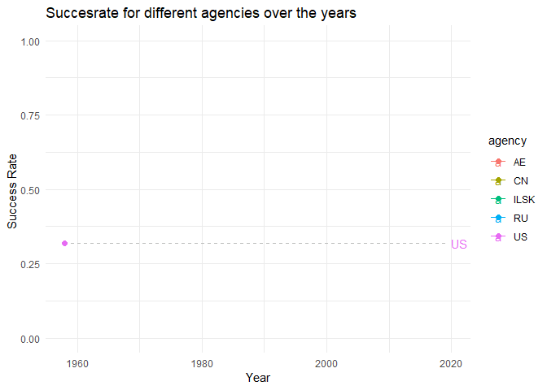

Tidy Tuesday - Space Launches
================
David Izydorczyk
17 Januar 2019

First, I start by loading the tidyverse library & the data.

``` r
library(tidyverse)
```

    ## -- Attaching packages ------------------- tidyverse 1.2.1 --

    ## v ggplot2 3.1.0     v purrr   0.2.5
    ## v tibble  2.0.1     v dplyr   0.7.8
    ## v tidyr   0.8.2     v stringr 1.3.1
    ## v readr   1.3.1     v forcats 0.3.0

    ## -- Conflicts ---------------------- tidyverse_conflicts() --
    ## x dplyr::filter() masks stats::filter()
    ## x dplyr::lag()    masks stats::lag()

``` r
library(magrittr)
```

    ## 
    ## Attaching package: 'magrittr'

    ## The following object is masked from 'package:purrr':
    ## 
    ##     set_names

    ## The following object is masked from 'package:tidyr':
    ## 
    ##     extract

``` r
library(gganimate)

space <- read.csv("../data/launches.csv")
```

Next, I am going to convert the data.frame into a tibble and inspect the data.

``` r
(space %<>% as_tibble())
```

    ## # A tibble: 5,726 x 11
    ##    tag       JD launch_date launch_year type  variant mission agency
    ##    <fct>  <dbl> <fct>             <int> <fct> <fct>   <fct>   <fct> 
    ##  1 1967~ 2.44e6 1967-06-29         1967 Thor~ ""      Secor ~ US    
    ##  2 1967~ 2.44e6 1967-08-23         1967 Thor~ ""      DAPP 3~ US    
    ##  3 1967~ 2.44e6 1967-10-11         1967 Thor~ ""      DAPP 4~ US    
    ##  4 1968~ 2.44e6 1968-05-23         1968 Thor~ ""      DAPP 5~ US    
    ##  5 1968~ 2.44e6 1968-10-23         1968 Thor~ ""      DAPP 6~ US    
    ##  6 1969~ 2.44e6 1969-07-23         1969 Thor~ ""      DAPP 7~ US    
    ##  7 1970~ 2.44e6 1970-02-11         1970 Thor~ ""      DAPP B~ US    
    ##  8 1970~ 2.44e6 1970-09-03         1970 Thor~ ""      DAPP B~ US    
    ##  9 1971~ 2.44e6 1971-02-17         1971 Thor~ ""      DAPP B~ US    
    ## 10 1971~ 2.44e6 1971-06-08         1971 Thor~ ""      P70-1   US    
    ## # ... with 5,716 more rows, and 3 more variables: state_code <fct>,
    ## #   category <fct>, agency_type <fct>

First, I want to inspect the succes and failure rate over the years.

``` r
space %>% 
  mutate(category_n = as.numeric(category)-1) %>%
  select(launch_year,category_n) %>% 
  group_by(launch_year) %>% 
  summarize(success_rate = mean(category_n)) %>% 
  ggplot(., aes(x = launch_year, y = success_rate))+ 
   geom_line()
```


We see a hugh increase in the succes rate over the years. Now lets see if there differences between the rocket types. However, as there are so many types I will just focus at the early years from, 1950 to 1970. Also I will focus only on the main type, deleting all additional main type information. Also lets first have a look on the frequencies of the main types.

``` r
space %>% 
  mutate(category_n = as.numeric(category)-1) %>%
  select(launch_year,category_n,type) %>% 
  filter(launch_year > 1950 & launch_year < 1970) %>% 
  mutate(type_d = gsub(" .*","",type)) %>% 
  mutate(type_d = gsub("-.*","",type_d)) %$%
  table(type_d)
```

    ## type_d
    ##    Atlas     Blue  Diamant   Europa     Juno  Jupiter   Kosmos   Lambda 
    ##      141        1        4        2       10        6      119        4 
    ##  Molniya        N  Project   Proton        R   Saturn    Scout    Soyuz 
    ##       60        2        6       18       15       15       52       18 
    ##   SPARTA  Sputnik     Thor   Thorad    Titan  Tsiklon  Uprated       UR 
    ##        1        6      254       28       52        9        1        5 
    ## Vanguard  Voskhod   Vostok 
    ##       10      113       82

We still have many different types. Therefore, lets only use those main types which have more than 100 entries.

``` r
space %>% 
  mutate(category_n = as.numeric(category)-1) %>%
  select(launch_year,category_n,type) %>% 
  filter(launch_year > 1950 & launch_year < 1970) %>% 
  mutate(type_d = gsub(" .*","",type)) %>% 
  mutate(type_d = gsub("-.*","",type_d)) %>%
  add_count(type_d) %>% 
  filter(n > 100) %>% 
  group_by(launch_year,type_d) %>% 
  summarize(success_rate = mean(category_n)) %>% 
  ggplot(., aes(x = launch_year, y = success_rate,color=type_d))+ 
   geom_line()
```


Mhh this looks not very interesting.

Lets try to make a animated bubble chart showing the increase of succes rate per agency.

``` r
agencies <- c("US","AE","CN","RU","ILSK")

space %>% 
  mutate(category_n = as.numeric(category)-1) %>%
  select(launch_year,category_n,agency) %>% 
  filter(agency %in% agencies)  %>% 
  group_by(launch_year,agency) %>% 
  summarize(n_starts = length(category_n),
            successes_rate = mean(category_n)) %>% 
  filter(n_starts > 1) %>% 
  ggplot(., aes(x = launch_year, y = successes_rate, color = agency, group=agency)) +  
        geom_line() + 
        geom_segment(aes(xend = 2019, yend = successes_rate), linetype = 2, colour = 'grey') + 
        geom_point(size = 2) + 
        geom_text(aes(x = 2020, label = agency), hjust = 0) + 
  labs(x = 'Year', y = 'Success Rate ', title = "Succesrate for different agencies over the years") +
  transition_reveal(launch_year) +
  coord_cartesian(clip = 'off') + 
  theme_minimal() 
```


